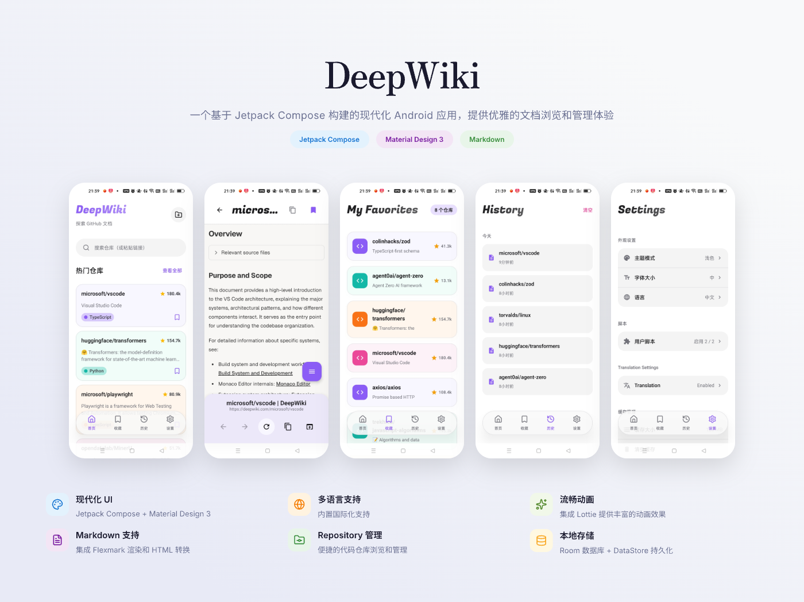

# DeepWiki

一个基于 Jetpack Compose 构建的现代化 Android 应用，提供优雅的文档浏览和管理体验。

## 特性

- **现代化 UI**：使用 Jetpack Compose 和 Material Design 3 构建
- **Markdown 支持**：集成 Flexmark 实现 Markdown 渲染和 HTML 转换
- **多语言支持**：内置国际化支持
- **主题系统**：支持自定义主题配置
- **Repository 管理**：便捷的代码仓库浏览和管理
- **SVG 图标支持**：使用 Coil 加载矢量图标
- **流畅动画**：集成 Lottie 提供丰富的动画效果
- **本地存储**：使用 Room 数据库和 DataStore 进行数据持久化

## 技术栈

### 核心框架
- **Jetpack Compose**：声明式 UI 框架
- **Kotlin**：主要开发语言
- **Material Design 3**：遵循最新设计规范

### 主要依赖库

| 库 | 版本 | 用途 |
|---|---|---|
| Jetpack Compose | BOM | UI 框架 |
| Material Icons Extended | 1.7.6 | 图标库 |
| Lottie Compose | 6.3.0 | 动画支持 |
| Flexmark | 0.64.8 | Markdown 处理 |
| DataStore Preferences | 1.1.1 | 偏好设置存储 |
| Coil | 2.6.0 | 图片加载 (包含 SVG) |
| Navigation Compose | 2.7.6 | 应用内导航 |
| Room | Latest | 本地数据库 |
| OkHttp | Latest | 网络请求 |
| Jsoup | Latest | HTML 解析 |

## 环境要求

- **Android Studio**：Hedgehog (2023.1.1) 或更高版本
- **JDK**：11 或更高版本
- **最低 Android 版本**：Android 7.0 (API 24)
- **目标 Android 版本**：Android 14+ (API 36)
- **Gradle**：8.0+

## 快速开始

### 克隆项目

```bash
git clone <repository-url>
cd Android
```

### 构建项目

```bash
# Linux/macOS
./gradlew build

# Windows
gradlew.bat build
```

### 运行应用

1. 在 Android Studio 中打开项目
2. 等待 Gradle 同步完成
3. 连接 Android 设备或启动模拟器
4. 点击运行按钮或执行：

```bash
./gradlew installDebug
```

### 生成签名 APK

项目包含测试签名文件 `test.jks`，用于开发构建：

```bash
./gradlew assembleRelease
```

## 项目结构

```
app/src/main/java/com/moxiang/deepwiki/
├── MainActivity.kt              # 主 Activity
├── MainNavigation.kt           # 导航配置
├── DeepWikiApplication.kt      # Application 类
├── core/
│   └── ui/
│       ├── components/         # 可复用 UI 组件
│       │   ├── SearchBar.kt
│       │   ├── LoadingIndicator.kt
│       │   ├── ErrorView.kt
│       │   ├── EmptyView.kt
│       │   ├── BrowserControls.kt
│       │   ├── TabBar.kt
│       │   ├── RepoCard.kt
│       │   └── ...
│       ├── locale/            # 多语言支持
│       │   ├── AppLanguage.kt
│       │   └── LanguagePreferenceStore.kt
│       └── theme/             # 主题配置
│           └── Shape.kt
```

## 核心功能模块

### UI 组件
- **SearchBar**：搜索栏组件
- **LoadingIndicator**：加载动画指示器
- **ErrorView/EmptyView**：错误和空状态视图
- **BrowserControls**：浏览器控制组件
- **TabBar**：标签栏导航
- **RepoCard/RepositoryCard**：仓库卡片展示

### 多语言支持
- 支持运行时语言切换
- 基于 DataStore 的偏好设置存储
- Composition Local 实现语言上下文

## 权限说明

应用需要以下权限：

- `INTERNET`：访问网络获取内容
- `ACCESS_NETWORK_STATE`：检查网络连接状态

## 开发指南

### 代码规范
- 遵循 Kotlin 官方编码规范
- 使用 Jetpack Compose 最佳实践
- Material Design 3 设计指南

### Git 工作流
1. 从 `main` 分支创建功能分支
2. 提交前确保代码通过编译
3. 编写清晰的 commit 信息
4. 提交 Pull Request 前进行代码审查

## License

Copyright 2024 MoXiang

## 联系方式

如有问题或建议，请提交 Issue 或 Pull Request。
